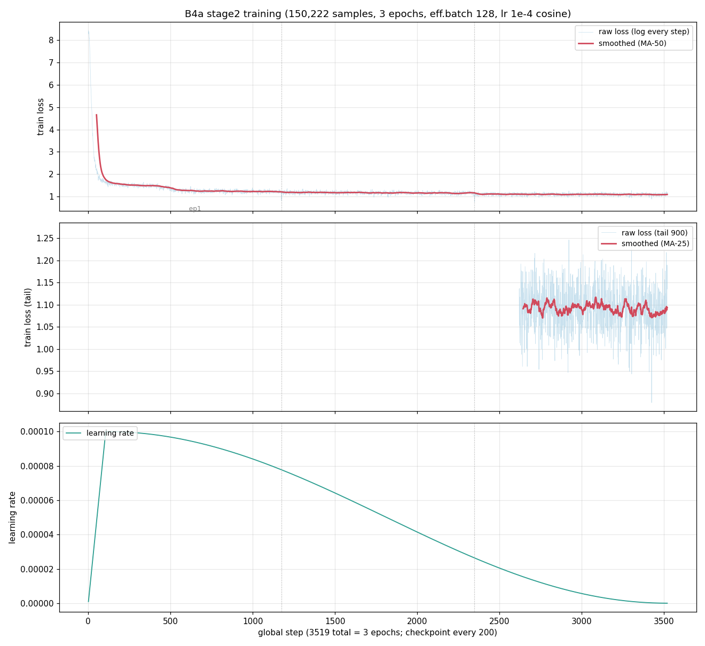
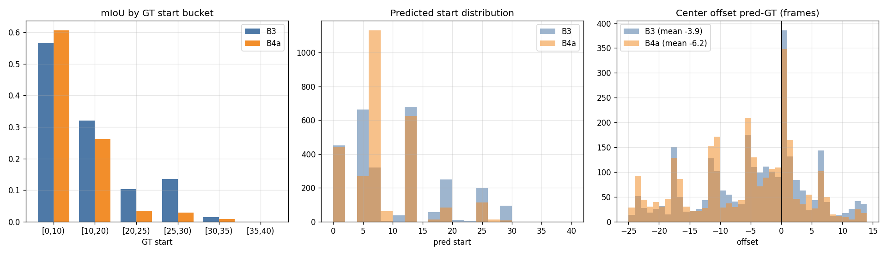

# 复现记录与基线演进（B0 → B4a）

本页汇总 `docs/` 与 `docs/learn docs/` 中的复现历程、各代基线数值与文档索引。**这些文档是排查"为什么这样做"的第一手资料**。更新至 2026-09-10：B3 为当前最优（mIoU 0.3467 超论文 0.311），B4a 实验完结（负结果，见下）；`mllm/b4dl_dataset/` 已做数据清理（1.5G→501M，中间变体现用现生）。

## 基线演进速览（B0 → B4a）

显著性阈值：**ΔmIoU > +0.013** / Δaccuracy > ±0.009 / 文本指标 ≥ 0.01（95% CI，B0 时代推导沿用）。

| 代号 | 配方（粗体 = 该代唯一上游变量） | acc | mIoU | 判定 |
|------|------|------|------|------|
| B0 | seqv3 切片 + 95K projector + ONCE 特征 | 0.7629 | 0.2696 | 首基线（08-29 四位一体锁定） |
| B1 | 切片 + **162K projector + 退火编码器新特征** | 0.7787 | 0.2653 | 换代（projector/特征） |
| B2 | **`--whole_scene` 整场景** + 旧 meta 语义 | 0.7649 | 0.1992 | TG 坍缩（61% 预测 (000,008)），反证输入构造问题 |
| B3 | 整场景 + **meta2（relative-to-previous 语义）** | 0.7526 | **0.3467** | ✅ 超论文 +0.036（**当前最优**） |
| B4a | B3 配方 + **TG 高帧段过采样 ×2**（150,222 条） | **0.7775** | 0.3271 | mIoU −0.0196 显著回退 → **负结果**，B3 保持基线 |

B3/B4a 详细数值（BLEU-4 0.0965/0.0976、ROUGE-L 0.3234/0.3269、BERTScore 0.8967/0.8977、METEOR-NLTK 0.3366/0.3378）见 [[Paper-vs-Reproduction]] 结果表与各 `mllm/eval_results/stage2_full_seqv3_mixed_b{3,4a}/metrics.json`（B4a 2026-09-08 18:18 完结，全量 30,145 条）。

### B4a 详情与 TG 回归分析（2026-09-08）

**动机**（B3 残余病灶，见 B3 复盘文档）：TG 高帧段欠覆盖——GT start≥25 在训练/测试各占 ~15%，B3 预测落回该段仅 13/413（≈3%），且整体 −3.9 帧偏早。

**方法**：`oversample_tg_highframe.py` 把训练集中 GT start≥25 的 1,951 条 TG 样本复制一份 → 150,222 条（出现频率 ×2），其余与 B3 完全一致（整场景 + meta2 + 162K projector，单卡门控等待后于 09-07 06:00 起训，3,519 步满 3 epoch）。

**结果**（`evaluation/analyze_tg_regression.py` 同口径闭区间 IoU 分桶对比，测试集 2,783 条 TG）：

| 项 | B3 | B4a | Δ |
|------|------|------|------|
| mIoU | 0.3467 | 0.3271 | **−0.0196**（超显著性半宽） |
| GT start≥25 段（n=413） | 0.1348/0.0146（25-30/30-35 桶） | 0.0296/0.0090 | **−0.0489**（专项反而恶化） |
| 预测 start≥25 命中数 | 13 条 | 6 条 | 覆盖不升反降 |
| start 均值偏移 | −3.90 帧 | −5.96 帧 | 偏早加剧 |
| top-1 预测区间 | [12-20] 占 23.3% | [06-14] 占 38.9% | 分布进一步向低帧集中 |
| acc | 0.7526 | 0.7775 | **+0.0249**（existence 0.6761→0.7244；binary 基本不动 0.8291→0.8306） |

**结论**：对"数据分布 ×2"的简单干预无效且有害——模型学会了更强的低帧先验（[06-14] 单区间占 38.9%），证明 TG 高帧段问题的根因不在训练分布，而在**输入没有任何显式帧号信号**（40 个视觉 token 只能靠位置数帧）。B4a 作为分布干预对照纳入档案；后续路线转向帧身份锚点（文本锚点 / 可学习帧嵌入）等输入构造消融，见 [[Paper-vs-Reproduction]] #8 与 learn docs 09-08 两份策略文档。

## 复现时间线（2026-07 ~ 2026-09）

| 阶段 | 内容 |
|------|------|
| 07 初 | plan1：打通训练管线（修复 mm_projector 768 维、验证特征链路） |
| 07-12 | VTimeLLM 源码分析；时序能力弱的根因分析（metatoken 缺失致命等 7 项） |
| 08-07~10 | 首次全量训练评测：定位 `<4DLiDAR>` token 未训练 bug；发现数据失衡（Yes 45.5%）导致模板化输出 |
| 08-24 | 论文对齐审计（A1-A9/B1-B6/R1-R4）：mIoU 半开区间 bug、per-scene 回退错配等修复；seqv3 数据格式引入 |
| 08-25 | seqv2 评测 acc 0.7647 首超论文但 TG 坍缩（(0,8) 占 87%）；两阶段法实测失败（acc 0.0001），决策回混合法 |
| 08-27 | seqv3-mixed 全量评测：acc 0.7629 达标、mIoU 0.2696 未达 |
| 08-28 | 权重核对：本地 ckpt 实为 ONCE 权重（domain gap）；评测数值口径考证（BERTScore 层号 bug 等）；启动 nuScenes 编码器自训 |
| 08-29 | 全仓库论文对齐审查；**基线 B0 正式锁定**；编码器退火链与早停监控上线；B1 全流水线启动 |
| 08-30~31 | 编码器退火 3ep 定稿（val MSE 0.0992）；特征全量重提（stage1 28,130 帧 + stage2 850 场景，ONCE 旧特征备份）；stage1 162K projector 重训 → **B1** mixed 重训（acc 0.7787 / mIoU 0.2653）——TG 形态正常（99.9% 可解析）但 49.3% 与 GT 零重叠，定位"序列局部帧号 vs 场景全局帧号"错位（corr=0.892） |
| 09-01~02 | **B2** 整场景输入（对齐官方 `--whole_scene`）反证：mIoU 0.1992、61% 预测塌缩 (000,008)（训练集仅占 9.4%）= 纯先验拟合——40 帧无帧号锚点学不会绝对定位；官方 checkpoint + 官方特征评测 acc 0.7542 / mIoU 0.1737 ≈ 论文 Table 4"无 Metatoken"行（0.763/0.161）→ **论文完整模型从未发布** |
| 09-02 | meta2：`ego_text.py` 渲染修复为论文 §4.1 **relative-to-previous** 语义（commit `4413b6b`）；`re_render_meta.py` 重渲染 113,053/148,271 条（35,218 条无帧号保留） |
| 09-04~05 | **B3** 训练评测（与 B2 唯一差异 = meta2 数据）：**mIoU 0.3467 超论文 0.311**；TG 解析率 99.9%、塌缩解除（最大单一预测 61%→23%），残余 −3.9 帧偏早与高帧段欠覆盖 |
| 09-06 | B3 复盘与全量进度总结归档（learn docs）；B4a 启动：TG 高帧段 1,951 条 ×2 过采样（150,222 条断言校验）挂 `b4apipeline` 门控 |
| 09-07 | METEOR 双口径溯源闭环（论文引用 [2]=Banerjee & Lavie 2005 = NLTK-2005；B0-B3 补算 0.3344~0.3371 全超论文 0.275）；B3 最优产物备份归档（`backups/`，467MB，sha256 manifest）；训练全流程分步详解（RL 挂载点底稿）与训练代码全景解析归档 |
| 09-08 | RL 引进可行性深度分析（实测环境 transformers 4.47/torch 2.8/peft 0.13.2，自写最小 GRPO 结论，M1-M4 里程碑）；训练优化角度分析（帧身份锚点等 A-G 策略）；**B4a 评测完结（18:18）→ 显著负结果**（本节第一小节） |
| 09-09 | checkpoint 精简（145G→1.7G：仅留 stage1 + B0/B3/B4a 顶层 adapter）与整包备份（`backups/`，1.4G tar）；**B3 最优训练方案存档**（可复现配方文档） |
| 09-10 | **`b4dl_dataset` 数据清理**：1.5G→501M（删 `.bak*` + 旧 80/10/10 划分链 + 被取代的 seq/seqv2/seqv3/两阶段变体），只留官方基座、B3 训练数据与评测元数据；每个删除项都有 §3 再生命令（`B4DL_b4dl_dataset数据清理记录_20260910.md`）；同日产出**迁移清单与 SSH 搬运手册**（新机布局/分批打包/验收） |

## 基线 B0 锁定（历史档案，2026-08-29）

2026-08-27 的 seqv3-mixed 全量评测当时被锁为首个复现基线 **B0**，四位一体（**此后 B1-B4a 已多次换代，本段仅为档案**）：

1. **6 个数据/权重组件 MD5**：test_qa（43959740…）、ego_metadata（c3f152b6…）、ego_frame_motion（91ecf31a…）、sequence_metadata（73857e61…）、stage1 projector（af218814…）、stage2 adapter（7565ce2d…）
2. **冻结的逐字评测命令**（B0/B1 seqv3 代际）：`--per_sequence --frame_motion --sequence_metadata --answer_frames`，greedy、fp16（B2+ 整场景代际改 `--whole_scene --per_sequence --answer_frames`）
3. **评测代码版本**：8b85cd2 起 evaluation/ 一度零变化（09-07 METEOR 双后端化后已再演进）
4. **特征目录**：重提特征 = 破坏可比性（B1 换代时触发重置）

**基线重置条件**（沿用至今）：换编码器/重提特征、换 projector 数据版本、改 mIoU 指标逻辑或 answer_frames 口径、测试集变化。

## 指标口径与对比规则（2026-09-07 更新）

- **与论文对比**：accuracy/mIoU 闭区间与论文同构；BLEU-4 pycocoevalcap 语料级（0.0965 vs 论文 0.095）；ROUGE-L rouge_score（0.3234 vs 0.322）；BERTScore 本地 roberta-large **强制第 17 层**（0.8967 vs 0.897）；**METEOR 主口径 NLTK-2005**（0.3366 vs 论文 0.275，2026-09-07 溯源：论文引用 [2] 即该实现），jar 版 `meteor_pycocoevalcap` 仅作与 B0-B3 旧表衔接的参考
- **当前对照基线 = B3**（2026-09-06 起）；对比命令冻结为 `--whole_scene --per_sequence --answer_frames`；判断显著改进沿用 ΔmIoU>+0.013 等阈值
- `--answer_frames` 用 GT 恢复归属属"还原论文原始评测设置"（oracle），报告中必须声明
- GPT-4o Score 缺失记 null 而非 0；predictions 已落盘，配 API key 后离线补算即可
- 双口径补算与规则细节：`docs/learn docs/B4DL_METEOR双口径溯源与评测规则_20260907.md`

## 产物备份

- `backups/B3_stage2_final_20260907.tar.gz`（467MB）：B3 最终 LoRA adapter + non_lora_trainables + config/trainer_state + 评测产物 + stage1 mm_projector.bin；sha256 校验通过，清单见 `backups/B3_stage2_final_20260907.manifest.txt`（同目录 gitignore 不入库）
- `backups/b4dl_seqv3_mixed_backup_20260827.tar.gz`：B0 时代备份

## 文档索引

### docs/（顶层）

| 文档 | 内容 |
|------|------|
| `B4DL_复现方案.md` | 论文+官方仓库逐行解析的完整复现方案：资源清单、流水线、命令超参、坑位清单、目标数值 |
| `mmb4dl.pdf` / `mmb4dl-md/` | 论文原文（PDF / markdown 版） |
| `参考/LiDAR LLM.py` | LiDAR-LLM（arXiv:2312.14074）单文件参考源码 |
| `参考/记录.md` | stage1/2 训练过程手记 |

### docs/learn docs/（23 篇开发记录，★ = 状态入口文档）

| 文档 | 主题 |
|------|------|
| `B4DL_b4dl_dataset数据清理记录_20260910.md` | ★ `b4dl_dataset` 台账：保留 15 项清单（含消费者）+ 删除 19 项清单 + 全部变体再生命令 |
| `B4DL_迁移清单与SSH搬运手册_20260910.md` | ★ 换机搬运：分批清单（A/B/C + 不搬项）、目标目录布局、打包/rsync/streaming 三法、新机落地与验收 |
| `B4DL_训练优化角度分析与策略_20260908.md` | ★ 除 RL 外优化策略盘点：帧身份锚点（根因级）/TG 重加权/RFT-DPO/动态 padding/DoRA/NEFTune/增广 + 行动序列 |
| `B4DL_RL引进可行性深度分析_20260908.md` | ★ RL 落地实测：环境版本、奖励语义目录、奖励空间统计、rollout/logprob 通路、显存账本、自写最小 GRPO 结论、M1-M4 里程碑 |
| `B4DL_训练全流程分步详解_RL引进挂载点_20260907.md` | ★ A 数据→E 归档六阶段逐段命令/产物/参数/幂等语义 + RL 挂载点标注 |
| `B4DL_训练代码全景解析_20260907.md` | 训练栈逐文件精读（train/dataset/trainer/model/scripts），附真实代码与行号 |
| `B4DL_METEOR双口径溯源与评测规则_20260907.md` | ★ METEOR = 论文[2]（Banerjee & Lavie 2005）NLTK 口径溯源、变体扫描、dual 评测规则 |
| `B4DL_工作进度总结_20260906.md` | ★ 全量进度快照：B0→B3 全链表、复现核心认知、待办对照、残余问题清单、路线图 |
| `B4DL_B3整场景meta修复mIoU超论文_20260906.md` | B3 复盘：meta2 语义修复 +0.147、官方模型未发布实证、TG 预测形态与残余问题 |
| `B4DL_学习计划与知识前提_20260831.md` | 学习计划与前置知识整理 |
| `B4DL_基线版本训练方法对比_20260830.md` | B0 与两阶段 seqv3 对照（同数据同 projector：混合单 LoRA vs 两段双 LoRA） |
| `B4DL_全仓库论文对齐审查_20260829.md` | ★ 四路深查的全面对齐审查与指标口径修正 |
| `B4DL_基线锁定与对比规则_20260829.md` | ★ B0 四位一体锁定、显著性阈值、B1/B2 规划 |
| `B4DL_待修改清单_20260829.md` | 按执行顺序的修复清单与完成进度 |
| `B4DL_评测数值对比与问题清单_20260828.md` | seqv3-mixed 分任务对比表 + 10 项问题清单 |
| `B4DL_LiDARCLIP权重核对_20260828.md` | ONCE 权重 domain gap 发现与编码器自训启动 |
| `B4DL_训练方法对比_论文vs复现_20260828.md` | seqv3-mixed 训练法与论文逐项对比 |
| `B4DL_seqv3混合训练评测分析_20260827.md` | seqv3 混合方案与两阶段法失败记录 |
| `B4DL_两阶段训练评测与混合法决策_20260826.md` | 两阶段法失败（acc 0.0001）与回退决策 |
| `B4DL_seqv2评测对比与坍缩分析_20260825.md` | TG 坍缩（(0,8) 占 87%）分析 |
| `B4DL_论文对齐审计_20260824.md` | 首次全面审计（B1-B6 修复项、greedy 解码） |
| `B4DL_vs_LiDAR-LLM_comparison.md` | 与 LiDAR-LLM（Q-Former 架构）逐维对比 |
| `VTimeLLM_analysis.md` | 源项目 VTimeLLM 分析与借鉴 |
